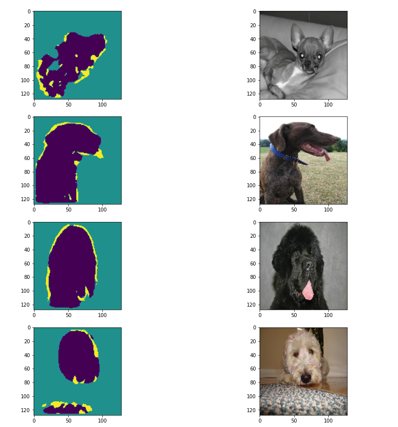
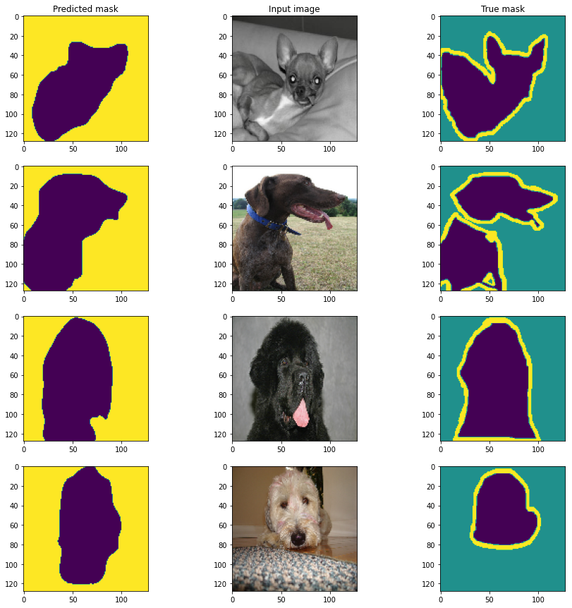

# EVA-8_Phase-1_Assignment-13

## Introduction

## Part-1 : UNET implementation with different varient
### Implementation-1: 
Notebook `EVA-8_Phase-1_Assignment-13\Part1-Unet-implementation\MaxPool_TransConv_Criterion.ipynb` contains the first implementation of UNET.
  
Below ar the creteria for the frist implementation:
 - Max-Pooling for reduction
 - Transpose-Convolution for upscaling
 - Binary-Cross-Entropy for loss calculation
 
Below are the results in the form of generated output mask and loss-accuracy plot for training.

 

### Implementation-2: 
Notebook `EVA-8_Phase-1_Assignment-13\Part1-Unet-implementation\MaxPool_TransConv_Dice.ipynb` contains the second implementation of UNET.
  
Below ar the creteria for the second implementation:
- Max-Pooling for reduction
- Transpose-Convolution for upscaling
- Dice loss for loss calculation

 
Below are the results in the form of generated output mask and loss-accuracy plot for training.

 

### Implementation-3: 
Notebook `EVA-8_Phase-1_Assignment-13\Part1-Unet-implementation\StrideConv_TransConv_Criterion.ipynb` contains the third implementation of UNET.
  
Below ar the creteria for the third implementation:
 - Strided-Convolution for reduction
 - Transpose-Convolution for upscaling 
 - Binary-Cross-Entropy for loss calculation

 
Below are the results in the form of generated output mask and loss-accuracy plot for training.

 

### Implementation-4: 
Notebook `EVA-8_Phase-1_Assignment-13\Part1-Unet-implementation\StrideConv_TransConv_Dice.ipynb` contains the fourth implementation of UNET.
  
Below ar the creteria for the fourth implementation:
 - Strided-Convolution for reduction
 - Transpose-Convolution for upscaling 
 - Dice loss for loss calculation

 
Below are the results in the form of generated output mask and loss-accuracy plot for training.

 

### Implementation-5: 
Notebook `EVA-8_Phase-1_Assignment-13\Part1-Unet-implementation\StrideConv_Upsample_Dice.ipynb` contains the fifth implementation of UNET.
  
Below ar the creteria for the fifth implementation:
 - Strided-Convolution for reduction
 - `nn.UpSample` for upscaling 
 - Dice loss for loss calculation

 
Below are the results in the form of generated output mask and loss-accuracy plot for training.

 

### Implementation-6:
Notebook `EVA-8_Phase-1_Assignment-13\Part1-Unet-implementation\StrideConv_Upsample_Criterion-Dice.ipynb` contains the sixth implementation of UNET.
  
Below ar the creteria for the sixth implementation:
 - Strided-Convolution for reduction
 - `nn.UpSample` for upscaling 
 - (Dice loss + Criterion loss) for loss calculation

 
Below are the results in the form of generated output mask and loss-accuracy plot for training.

 

## Part-2 : VAE implementation with MNIST and CIFAR
### Mnist implementation
##### images with labels into the pipeline
 
##### images without labels

### CIFAR implementation
##### images with labels into the pipeline
 
##### images without labels in the inferencing pipeline
