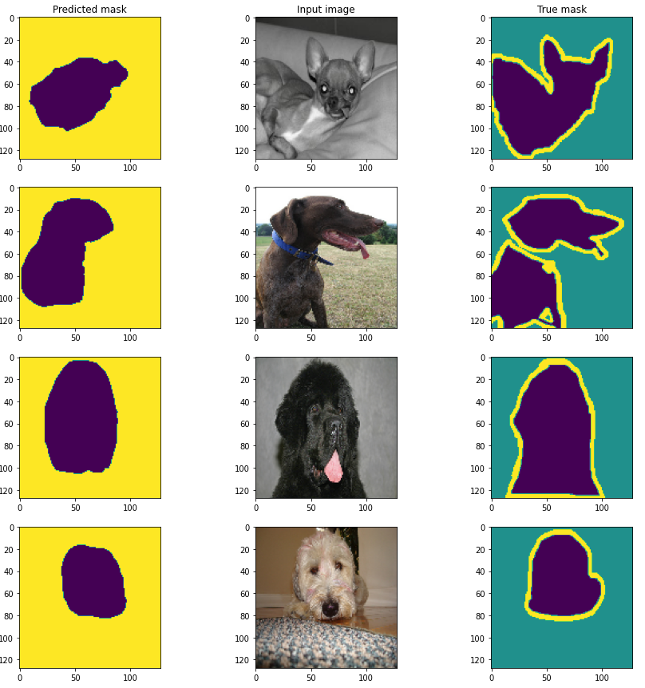
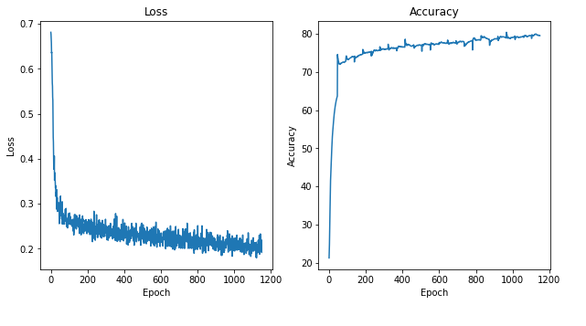
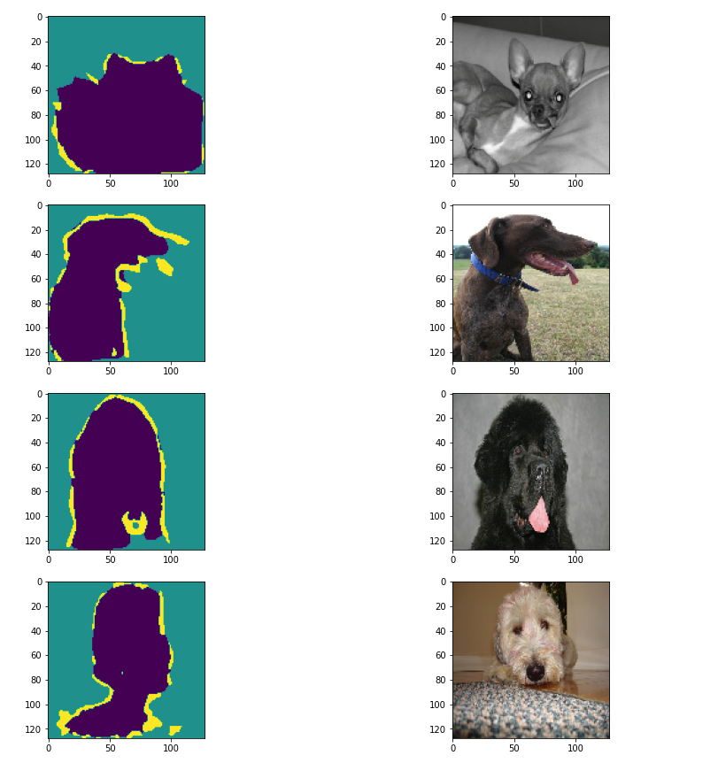
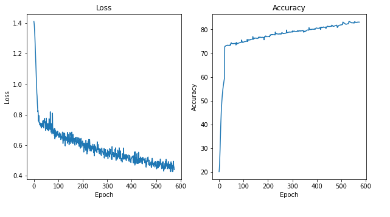

# EVA-8_Phase-1_Assignment-13
This is the assignment of 13th session in Phase-1 of EVA-8 from TSAI
## Introduction
There are two part to this assignment:

**First part** of your assignment is to train your own UNet from scratch, you can use the dataset and strategy provided in this linkLinks to an external site.. However, you need to train it 4 times:

MP+Tr+BCE, MP+Tr+Dice Loss, StrConv+Tr+BCE, StrConv+Ups+Dice Loss and report your results.

**Second Part** is:

- Share the MNIST notebook link ON GITHUB
- Share the CIFAR notebook link ON GITHUB 
- Upload the 25 MNIST outputs PROPERLY labeled 
- Upload the 25 CIFAR outputs PROPERLY labeled. 

## Part-1 : UNET implementation with different varient
As a part-1 of the assignment, I have implemented total of 6 experiments including the 4 required for the assignment.
### About UNET architecture
The UNET architecture is a convolutional neural network commonly used in image segmentation tasks. It consists of an encoder and a decoder network with skip connections that allow the decoder to recover spatial information lost during the encoding process. The architecture has been widely adopted in medical image analysis, as it can accurately segment organs and tumors in CT and MRI scans.

### Implementation-1: 
Notebook `EVA-8_Phase-1_Assignment-13\Part1-Unet-implementation\MaxPool_TransConv_Criterion.ipynb` contains the first implementation of UNET.
  
Below ar the creteria for the frist implementation:
 - Max-Pooling for reduction
 - Transpose-Convolution for upscaling
 - Binary-Cross-Entropy for loss calculation
 
Below are the results in the form of generated output mask and loss-accuracy plot for training.

 

### Implementation-2: 
Notebook `EVA-8_Phase-1_Assignment-13\Part1-Unet-implementation\MaxPool_TransConv_Dice.ipynb` contains the second implementation of UNET.
  
Below ar the creteria for the second implementation:
- Max-Pooling for reduction
- Transpose-Convolution for upscaling
- Dice loss for loss calculation

 
Below are the results in the form of generated output mask and loss-accuracy plot for training.

 

### Implementation-3: 
Notebook `EVA-8_Phase-1_Assignment-13\Part1-Unet-implementation\StrideConv_TransConv_Criterion.ipynb` contains the third implementation of UNET.
  
Below ar the creteria for the third implementation:
 - Strided-Convolution for reduction
 - Transpose-Convolution for upscaling 
 - Binary-Cross-Entropy for loss calculation

 
Below are the results in the form of generated output mask and loss-accuracy plot for training.

 

### Implementation-4: 
Notebook `EVA-8_Phase-1_Assignment-13\Part1-Unet-implementation\StrideConv_TransConv_Dice.ipynb` contains the fourth implementation of UNET.
  
Below ar the creteria for the fourth implementation:
 - Strided-Convolution for reduction
 - Transpose-Convolution for upscaling 
 - Dice loss for loss calculation

 
Below are the results in the form of generated output mask and loss-accuracy plot for training.

 

### Implementation-5: 
Notebook `EVA-8_Phase-1_Assignment-13\Part1-Unet-implementation\StrideConv_Upsample_Dice.ipynb` contains the fifth implementation of UNET.
  
Below ar the creteria for the fifth implementation:
 - Strided-Convolution for reduction
 - `nn.UpSample` for upscaling 
 - Dice loss for loss calculation

 
Below are the results in the form of generated output mask and loss-accuracy plot for training.

 

### Implementation-6:
Notebook `EVA-8_Phase-1_Assignment-13\Part1-Unet-implementation\StrideConv_Upsample_Criterion-Dice.ipynb` contains the sixth implementation of UNET.
  
Below ar the creteria for the sixth implementation:
 - Strided-Convolution for reduction
 - `nn.UpSample` for upscaling 
 - **(Dice loss + Criterion loss)** for loss calculation

 
Below are the results in the form of generated output mask and loss-accuracy plot for training.

 

## Part-2 : VAE implementation with MNIST and CIFAR
As Part-2 of the assignment, below are the generated images from trained VAE on CIFAR and MNIST dataset.
Here one image has no labels passed and with other image, we have passed some random label.

### About VAE
The Variational Autoencoder (VAE) is a type of generative neural network that learns a compressed representation of input data, such as images or text. Unlike traditional autoencoders, VAEs are designed to generate new data samples by sampling from a learned distribution. This is achieved through the use of a probabilistic encoder and decoder, which allows the network to capture the underlying statistical structure of the input data. VAEs have been used for a variety of tasks, such as image synthesis, data compression, and anomaly detection.

### Custom architecture to include labels

### Mnist implementation
##### images with labels into the pipeline
 
##### images without labels

### CIFAR implementation
##### images with labels into the pipeline
 
##### images without labels in the inferencing pipeline
